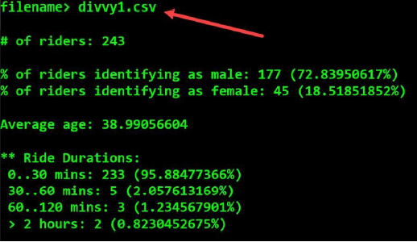
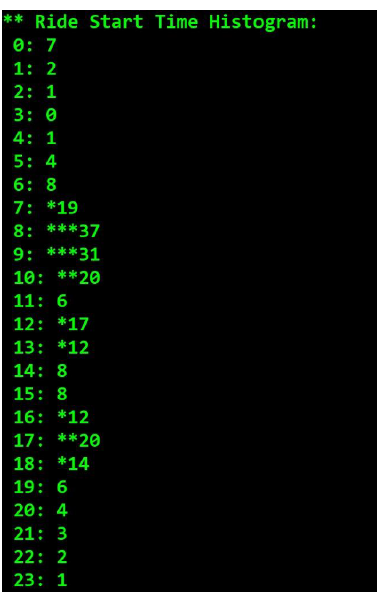
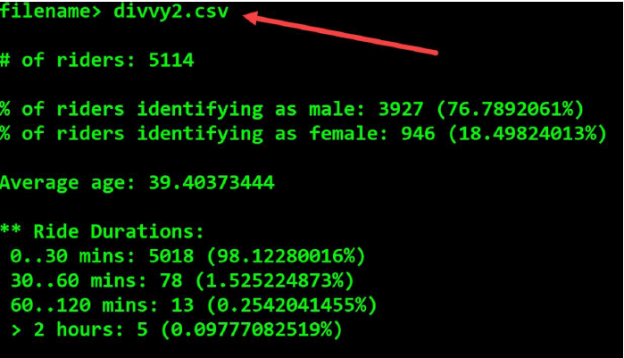
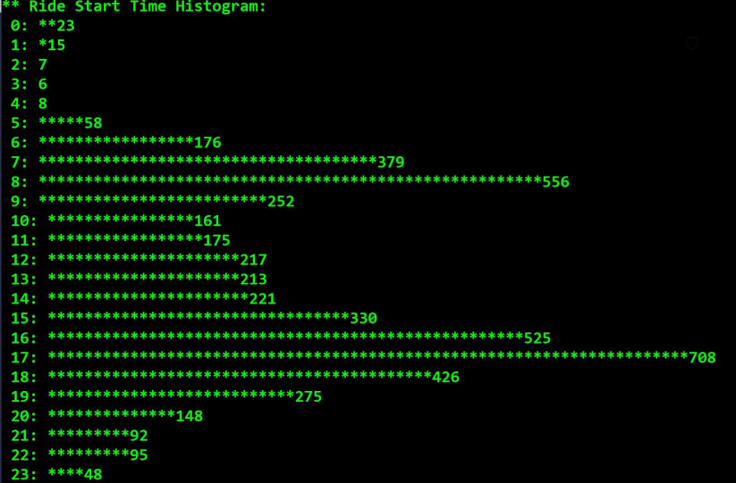

# Divvy_Ride_Analysis
The goal of the application is to input ride data for one day, and perform some analysis of the data: # of rides, the % of riders that identify as male and female, the average ride duration, etc.

Here are some screenshots:

